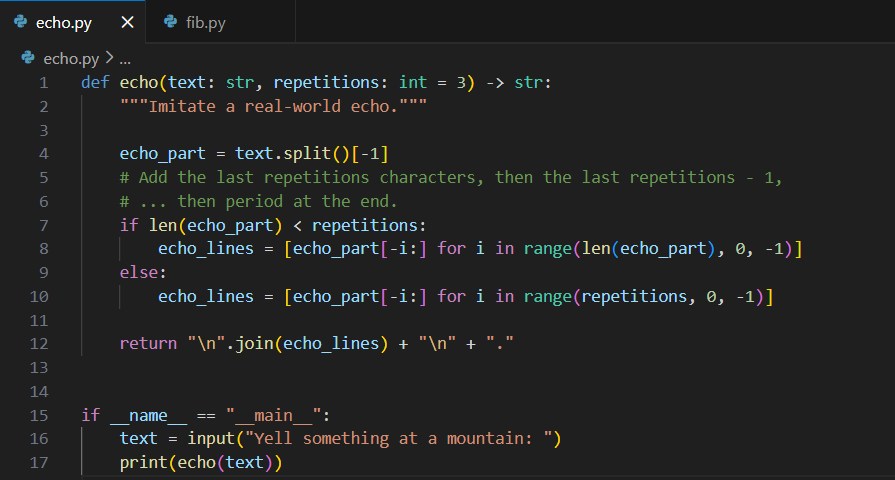
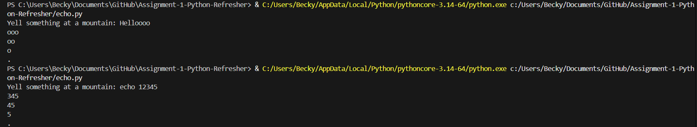
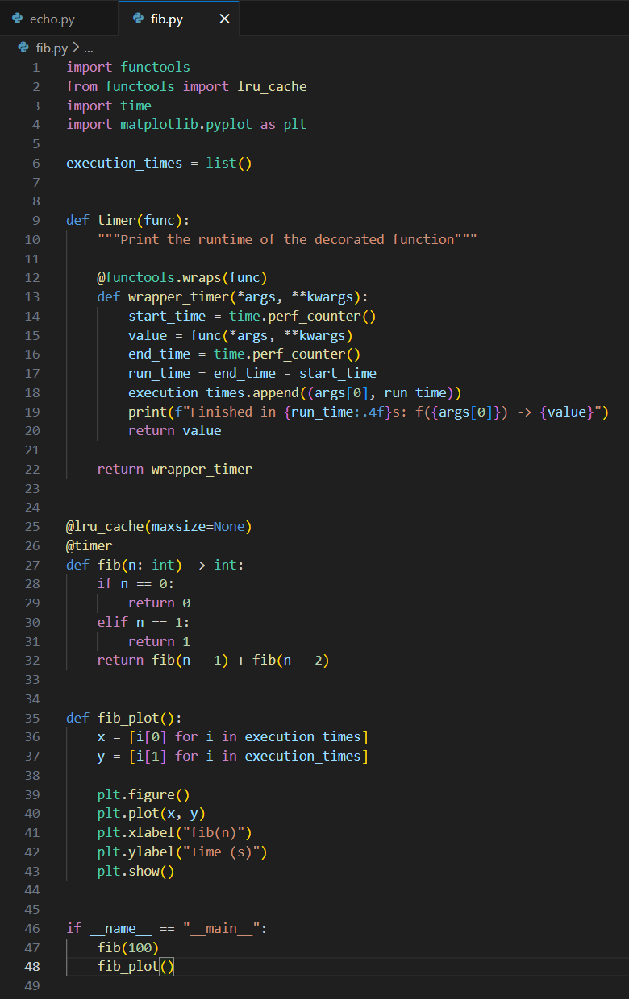
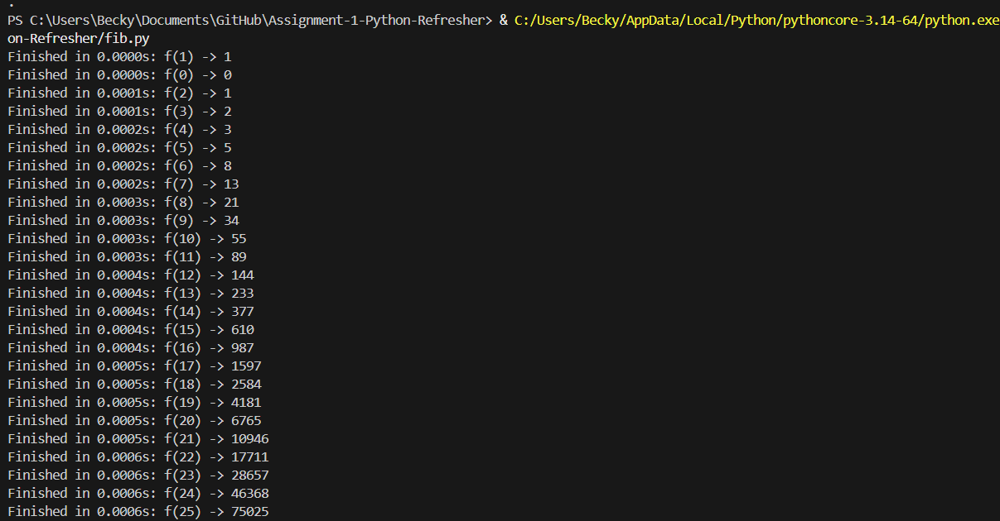
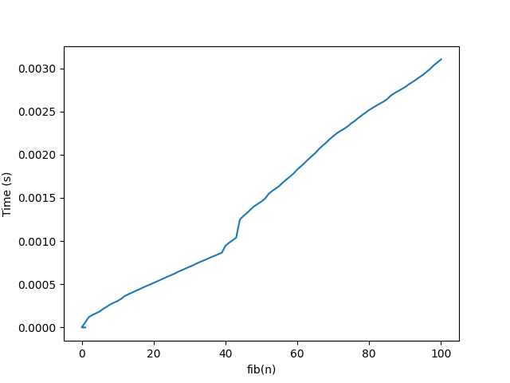

# Python Programming Basics and Decorator Implementation
This repository contains my work for **Assignment 1: Python Refresher**. 
My assignment contains two parts:
1) Python programming basics (echo function)
2) Python decorator implementation (Fibonacci recursive function, with caching and a timer) 
Python files, along with screenshots of code and outputs are included below with documentation. 

## Repository Structure
- `echo.py` - Python script containing an echo function
- `fib.py` - Python script containing a Fibonacci recursive function that caches calculated Fibonacci numbers and calculates runtime in seconds. This script also outputs a plot of Fibonacci numbers over runtime.
- `fib_plot.png` - Photo of the output plot from `fib.py`
- `code_images/`
  - `echo_code.png`
  - `fib_code.png` 
- `output_images/`
  - `echo_output.png`
  - `fib_output.png`
- `README.md` - Assignment documentation

## Part 1: Python Programming Basics (echo function)
The Python file `echo.py` imitates a real-world echo using the function echo(), which contains two input parameters: `text`, a string that represents what the user yells at a mountain, and `repetitions`, an integer that represents the number of times the mountain echoes the user's voice, with the default value being 3. An image of the code is shown below and is included in the `code_images/` folder.  

  

`echo()` then returns a string which represents the echoed sound with a fading effect and ending the echo with a period. 
Output examples are shown below and are included in the `output_images/` folder.  
  

## Part 2: Python Decorator Implementation (Fibonacci function)
The Python file `fib.py` computes the nth Fibonacci number recursively, which will increase the calculation runtime as integer `n` gets larger. To optimize the execution time, a `lru_cache` decorator from `functools` from the Python package `functools` will be used. A timer decorator is also used to calculate and display the execution time.  
The Python file `fib.py` also uses the package `matplotlib.pyplot` to graph the Fibonacci numbers over runtime in seconds after the program runs. 
An image of the code is shown below and is included in the `code_images/` folder.  

  

An out example is shown below and is included in the `output_images/` folder.The Python file `fib.py` computes the nth Fibonacci number recursively, which will increase the calculation runtime as integer `n` gets larger. To optimize the execution time, a `lru_cache` decorator from `functools` from the Python package `functools` will be used. A timer decorator is also used to calculate and display the execution time.  
The Python file `fib.py` also uses the package `matplotlib.pyplot` to graph the Fibonacci numbers over runtime in seconds after the program runs. 

An image of the code is shown below and is included in the `code_images/` folder.  

  

Below is the graph plotting the `n` Fibonacci number calculation over time in seconds. `fib_plot.png` can also be found in the repository.   

  

Because `lru_cache` stores previous calculations of Fibonacci numbers, the execution time increases more linearly as `n` increases. In this recursive function, it is ideal to store previous calculations for better optimization.

